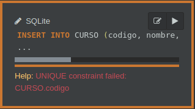

# SQL-Inicial
## Menú
* Tema 1 - Manipulacion.
	* [Ejercicios.](#tema-1---manipulacion)
	* [Documentacion.(https://github.com/PostaElio/SQL-Inicial/blob/main/source/sql-join.pdf)
* Tema 2 - Join.
	* Documentacion.
* Tema 3 - Queries.
	* [Ejercicios.](#tema-3---queries)
	* Documentacion.
* [Creacion de Tablas.](#tablas)
---
## Tema 1 - Manipulacion
### Ejercicio 1:
~~~
Cree una tabla llamada CURSO con los atributos: 
Código de curso (clave primaria, entero no nulo)
Nombre (varchar no nulo)
Descripcion (varchar)
Turno (varchar no nulo)
~~~
```sql
CREATE TABLE CURSO (
	codigo INT PRIMARY KEY NOT NULL,
  	nombre VARCHAR(15) NOT NULL,
  	descripcion VARCHAR(200),
  	turno VARCHAR(15) NOT NULL
);
```
### Ejercicio 2:
~~~
Agregue un campo “cupo” de tipo numérico
~~~
```sql
ALTER TABLE CURSO ADD cupo INT;
```
### Ejercicio 3:
~~~
Inserte datos en la tabla:

(101, “Algoritmos”,”Algoritmos y Estructuras de Datos”,”Mañana”,35)

(102, “Matemática Discreta”,””,”Tarde”,30)
~~~
```sql
INSERT INTO CURSO (codigo, nombre, descripcion, turno, cupo) 
VALUES (101, 'Algoritmos','Algoritmos y Estructuras de Datos','Mañana',35);

INSERT INTO CURSO (codigo, nombre, descripcion, turno, cupo) 
VALUES (102, 'Matemática Discreta','','Tarde',30);
```
### Ejercicio 4 
~~~
Cree un registro con el nombre nulo y verifique que no funciona.
~~~
```sql
INSERT INTO CURSO (codigo, descripcion, turno, cupo) 
VALUES (109,'','Tarde',30);
```
#### Output

### Ejercicio 5
~~~
Cree un registro con la clave primaria repetida y verifique que no funciona.
~~~
```sql
INSERT INTO CURSO (codigo, nombre, descripcion, turno, cupo) 
VALUES (102, 'Programacion','','Tarde',20);
```
#### Output

### Ejercicio 6
~~~
Actualice, para todos los cursos, el cupo en 25.
~~~
```sql
UPDATE CURSO SET cupo = 25;
```
### Ejercicio 7
~~~
Elimine el curso Algoritmos
~~~
```sql
DELETE FROM CURSO WHERE nombre = 'Algoritmos';
```
---
## Tema 3 - Queries
### Ejercicio 1
~~~
Nombre, apellido y fecha de nacimiento de todos los empleados, ordenado por fecha de nacimiento ascendente.
~~~
```sql
SELECT p.nombre , p.apellido, p.fecha_nacimiento
FROM profesor p ORDER by p.fecha_nacimiento Asc;
```
#### Output

### Ejercicio 2
~~~
Todos los profesores cuyo salario sea mayor o igual a 65000.
~~~
```sql
SELECT * FROM profesor p WHERE p.salario >= 65000;
```
#### Output

### Ejercicio 3
~~~
Todos los profesores que nacieron en la década del 80.
~~~
```sql
SELECT * FROM profesor WHERE fecha_nacimiento BETWEEN '1980-01-01' and '1989-12-31';
```
#### Output

### Ejercicio 4
~~~
5 registros
~~~
```sql
SELECT * FROM profesor p LIMIT 5;
```
#### Output

### Ejercicio 5
~~~
Todos los profesores cuyo apellido inicie con la letra “P”
~~~
```sql
SELECT * FROM profesor p WHERE p.apellido LIKE 'P%'
```
#### Output

### Ejercicio 6
~~~
Los profesores que nacieron en la década del 80 y tienen un salario mayor a 80000
~~~
```sql
SELECT * FROM profesor WHERE fecha_nacimiento 
BETWEEN '1980-01-01' and '1989-12-31' AND salario > 80000;
```
#### Output


---
## Tablas

### Creacion de la tabla **Profesor** con sus respectivas entidades.
```sql
CREATE TABLE PROFESOR (
	id INTEGER PRIMARY KEY AUTOINCREMENT,
  	nombre VARCHAR(15) NOT NULL,
    apellido VARCHAR(15) NOT NULL,
  	fecha_nacimiento date NOT NULL, 
	salario INT NOT NULL
);
INSERT INTO PROFESOR (nombre, apellido, fecha_nacimiento, salario) 
VALUES ('Juan','Pérez', '1990-06-06', 55000);

INSERT INTO PROFESOR (nombre, apellido, fecha_nacimiento, salario) 
VALUES ('María Emilia','Paz', '1984-07-15', 72000);

INSERT INTO PROFESOR (nombre, apellido, fecha_nacimiento, salario) 
VALUES ('Marin','Correa', '1987-12-07', 63000);

INSERT INTO PROFESOR (nombre, apellido, fecha_nacimiento, salario) 
VALUES ('Lucía','Díaz', '1991-02-24', 45000);

INSERT INTO PROFESOR (nombre, apellido, fecha_nacimiento, salario) 
VALUES ('Raúl','Martínez', '1980-10-15', 85000);

INSERT INTO PROFESOR (nombre, apellido, fecha_nacimiento, salario) 
VALUES ('Mabel','Ríos', '1982-06-12', 83000);
```
### Creacion de la tabla **Curso** con sus respectivas entidades.
```sql
CREATE TABLE CURSO (
	codigo INT PRIMARY KEY NOT NULL,
  	nombre VARCHAR(15) NOT NULL,
  	descripcion VARCHAR(200),
  	turno VARCHAR(15) NOT NULL,
    cupo INT NOT NULL,
  	PROFESOR_ID INTEGER,
  	FOREIGN KEY (PROFESOR_ID) REFERENCES PROFESOR(id)
);
INSERT INTO CURSO (codigo, nombre, descripcion, turno, cupo, PROFESOR_ID) 
VALUES (101, 'Algoritmos','Algoritmos y estructuras de datos','Mañana',20,1);

INSERT INTO CURSO (codigo, nombre, descripcion, turno, cupo, profesor_id)
VALUES (102, 'Matematica Discreta',null,'Tarde',20,2);

INSERT INTO CURSO (codigo, nombre, descripcion, turno, cupo, profesor_id) 
VALUES (103, 'Programacion Java','POO en Java','Noche',35, 4);

INSERT INTO CURSO (codigo, nombre, descripcion, turno, cupo, profesor_id) 
VALUES (104, 'Programacion Web',null,'Noche',35, 5);

INSERT INTO CURSO (codigo, nombre, descripcion, turno, cupo, profesor_id) 
VALUES (105, 'Programacion C#','.NET, Visual Strudio 2019','Noche',30, 6);
```
