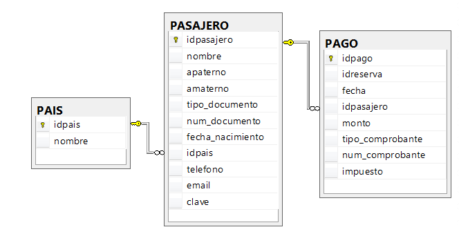
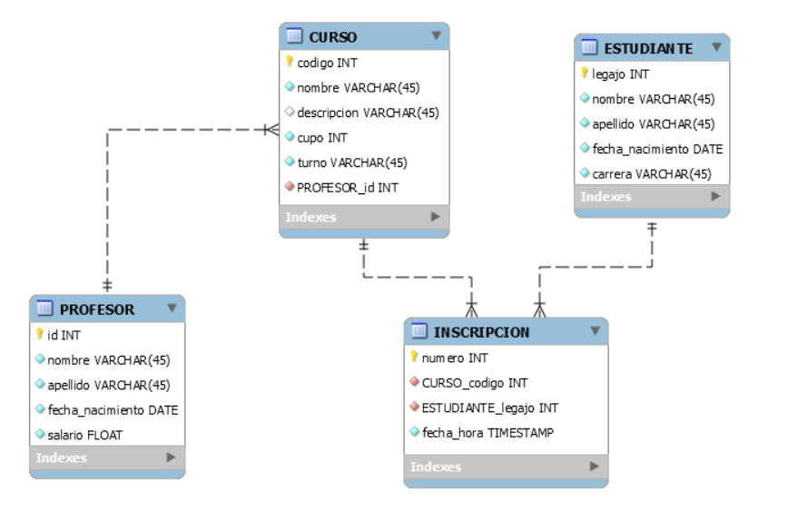

# SQL-Intermedio
## Indice
* Tema 1 - Funciones agregadas.
	* [Ejercicios.](#tema-1---funciones-agregadas)
	* [Documentacion.](https://github.com/PostaElio/SQL-Inicial/blob/main/sql2/source/sql2-funciones-agregadas.pdf)
* Tema 2 - Multiples Tables.
	* [Ejercicios.](#tema-2---multiples-tables)
	* [Documentacion.](https://github.com/PostaElio/SQL-Inicial/blob/main/sql2/source/sql2-multiples-tables.pdf)
* Tema 3 - Indices.
	* [Ejercicios.](#tema-3---???)
	* [Documentacion.](https://github.com/PostaElio/SQL-Inicial/blob/main/sql2/source/sql2-indices.pdf)
* Tema 4 - Queries anidadas.
	* [Ejercicios.](#tema-3---???)
	* [Documentacion.](https://github.com/PostaElio/SQL-Inicial/blob/main/sql2/source/sql2-queries-anidadas.pdf)

---
## Tema 1 - Funciones agregadas
### Ejercicio 1:
~~~
Escriba una consulta para saber cuántos estudiantes son de la carrera Mecánica.
~~~
```sql
SELECT COUNT(*) AS cantidad_de_estudiantes_que_estudian_la_carrera_mecanica
FROM estudiante where carrera LIKE 'Mecánica'
```
### Ejercicio 2:
~~~
Escriba una consulta para saber, de la tabla PROFESOR, el salario mínimo
de los profesores nacidos en la década del 80.
~~~
```sql
SELECT MIN(salario) AS salario_minimo FROM profesor WHERE fecha_nacimiento 
BETWEEN '1980-01-01' and '1989-12-31';
```
### Ejercicio 3:
~~~
Para el siguiente modelo relacional:
~~~

### Ejercicio 4:
~~~
Escriba las siguientes consultas:
~~~
~~~
Cantidad de pasajeros por país
~~~
```sql
/*ponemos el nombre del pasajero en el COUNT 
para que detecte los valores null y los tome como 0*/
SELECT DISTINCT p1.nombre, COUNT(p2.nombre) 
AS cantidad_de_pasajeros_por_pais
FROM pais p1 LEFT JOIN pasajero p2 GROUP BY p1.nombre;
```
~~~
Suma de todos los pagos realizados
~~~
```sql
/*DE que depende la suma de todos los pagos?
solo la suma de todos los montos, o de la suma de todos los montos
restando/sumando jeje los impuestos?*/
SELECT SUM(monto) AS suma_de_todos_los_pagos FROM PAGO;
```
~~~
Suma de todos los pagos que realizó un pasajero. El monto debe aparecer 
con dos decimales.
~~~
```sql
/*falta testear, creeria que funciona*/
SELECT idpasajero, ROUND(SUM(monto),2) AS suma_de_todos_los_pagos
FROM PAGO GROUP BY idpasajero;
```
~~~
Promedio de los pagos que realizó un pasajero.
~~~
```sql
/*DEberia de buscar un personaje en especifico?*/
SELECT AVG(monto) FROM PAGO GROUP BY idpasajero;
```
---
## Tema 2 - Multiples Tables
#### Para el siguiente modelo relacional:

### Ejercicio 1:
~~~
Nombre, apellido y cursos que realiza cada estudiante
~~~
```sql
SELECT e.nombre, e.apellido , c.nombre AS nombre_curso FROM ESTUDIANTE e
INNER JOIN INSCRIPCION i ON e.legajo = i.ESTUDIANTE_legajo 
INNER JOIN CURSO c ON i.CURSO_codigo = c.codigo
```
### Ejercicio 2:
~~~
Nombre, apellido y cursos que realiza cada estudiante, ordenados por el nombre
del curso
~~~
```sql
SELECT e.nombre, e.apellido , c.nombre AS nombre_curso FROM ESTUDIANTE e
INNER JOIN INSCRIPCION i ON e.legajo = i.ESTUDIANTE_legajo 
INNER JOIN CURSO c ON i.CURSO_codigo = c.codigo
ORDER BY c.nombre
```
### Ejercicio 3:
~~~
Nombre, apellido y cursos que dicta cada profesor
~~~
```sql
SELECT p.nombre , p.apellido, c.nombre AS nombre_curso FROM PROFESOR p INNER
JOIN CURSO c ON p.id = c.PROFESOR_id 
```
### Ejercicio 4:
~~~
Nombre, apellido y cursos que dicta cada profesor, ordenados por el nombre del
curso
~~~
```sql
SELECT p.nombre , p.apellido, c.nombre AS nombre_curso FROM PROFESOR p INNER
JOIN CURSO c ON p.id = c.PROFESOR_id 
ORDER BY c.nombre
```
### Ejercicio 5:
~~~
Cupo disponible para cada curso (Si el cupo es de 35 estudiantes y hay 5
inscriptos, el cupo disponible será 30)
~~~
```sql
/*hacemos leftjoin para poder tener los campos null, ya que puede haber
curos con ninguna inscripcion y en ese caso restariamos 0(null) por que 
la fecha_hora del la inscripcion estaria null */
SELECT c.codigo , c.cupo - COUNT(i.fecha_hora) AS cupo_disponible FROM CURSO c
LEFT JOIN INSCRIPCION i ON c.codigo = i.CURSO_codigo GROUP BY c.codigo
```
### Ejercicio 6:
~~~
Cursos cuyo cupo disponible sea menor a 10
~~~
```sql
/*No puede haber HAVING sin GROUP BY*/
SELECT * FROM CURSO 
cupo es el cupo maximo CONST o
es una variable que incrementa cuando se inscriben?
```
---
## Tema 3 - Indices
### Ejercicio 1:


---
## Tema 4 - Queries anidadas
### Ejercicio 1:
~~~
Escriba una consulta que devuelva la cantidad de profesores que dictan más de un
curso en el turno Noche.
~~~
```sql
SELECT COUNT(*) AS cantidad_de_profesores_que_dictan_mas_de_un_curso_en_el_turno_noche
FROM PROFESOR p INNER JOIN CURSO c ON p.id = c.PROFESOR_id WHERE c.turno = 'Noche'
GROUP BY


sELECT COUNT(*)
from (
     select profesor id, copunt(*)
     from curso
      where turno='noche'
     group by profesor id
      havoing count(*)>1

)

```
### Ejercicio 2:
~~~
Escriba una consulta para obtener la información de todos los estudiantes que no
realizan
el curso con código 105.
~~~
```sql
SELECT * FROM ESTUDIANTE WHERE legajo NOT IN (SELECT DISTINCT ESTUDIANTE_legajo 
FROM INSCRIPCION WHERE CURSO_codigo = 105);
```
# Evaluacion Integral
## Ejercitacion I:
### Ejercicio 1:
~~~
Escriba una consulta que devuelva el legajo y la cantidad de cursos que realiza cada
estudiante.
~~~
```sql
/*Hacemos left join para obtener valores null, ya que un estudiante puede estar 
inscripto en ningun cruso por el momento*/
SELECT e.legajo, COUNT(i.CURSO_codigo) AS cantidad_de_cursos_inscripto FROM ESTUDIANTE e
LEFT JOIN INSCRIPCION i ON e.legajo = i.ESTUDIANTE_legajo GROUP BY e.legajo;
```
### Ejercicio 2:
~~~
Escriba una consulta que devuelva el legajo y la cantidad de cursos de los estudiantes que
realizan más de un curso.
~~~
```sql
/*Va con un having*/
SELECT e.legajo, COUNT 
```
### Ejercicio 3:
~~~
Escriba una consulta que devuelva la información de los estudiantes que no realizan ningún
curso.
~~~
```sql
SELECT * FROM ESTUDIANTE WHERE legajo NOT IN (SELECT ESTUDIANTE_legajo FROM INSCRIPCION);
```
### Ejercicio 4:
~~~
Escriba para cada tabla, los index (incluyendo su tipo) que tiene cada una.
~~~
#### **PROFESOR**													
| COLUMNA 			| TIPO 			| INDEX     	|           
| :---      		|     :---      |      :--- 	|
| id 				| INT     		| CLUSTERED 	|
| nombre  			| VARCHAR(45)   |       		|
| apellido   		| VARCHAR(45)   |       		|
| fecha_nacimiento  | DATE       	|       		|
| salario   		| FLOAT         |      			|

#### **CURSO**													
| COLUMNA 			| TIPO 			| INDEX  		|           
| :---      		|     :---      |      :--- 	|
| codigo 			| INT     		|   CLUSTERED 	|
| nombre 			| VARCHAR(45)   |   			|
| descripcion 		| VARCHAR(45)   |   			|
| cupo 				| INT     		| 				|
| turno 			| VARCHAR(45)   |   			|
| PROFESOR_id 		| INT     		| NON CLUSTERED |

#### **INSCRIPCION**													
| COLUMNA 			| TIPO 			| INDEX  		|           
| :---      		|     :---      |      :--- 	|
| numero 			| INT     		|   CLUSTERED 	|
| CURSO_codigo 		| INT     	 	| NON CLUSTERED |
| ESTUDIANTE_legajo | INT     		| NON CLUSTERED |
| fecha_hora  		| TIMESTAMP     |       		|

#### **ESTUDIANTE**													
| COLUMNA 			| TIPO 			| INDEX  		|           
| :---      		|     :---      |      :--- 	|
| legajo 			| INT     		|   CLUSTERED 	|
| id 				| INT     		|           	|
| nombre  			| VARCHAR(45)   |       		|
| apellido   		| VARCHAR(45)   |       		|
| fecha_nacimiento  | DATE       	|       		|
| carrera  			| VARCHAR(45)  	|       		|
### Ejercicio 5:
~~~
Liste toda la información sobre los estudiantes que realizan cursos con
los profesores de apellido “Pérez” y “Paz”.
~~~
```sql
SELECT * FROM ESTUDIANTE WHERE legajo IN (
SELECT ESTUDIANTE_legajo FROM INSCRIPCION i 
INNER JOIN CURSO c ON i.CURSO_codigo = c.codigo 
INNER JOIN PROFESOR p ON p.id = c.PROFESOR_id 
WHERE p.apellido IN ('Pérez','Paz'));
```


